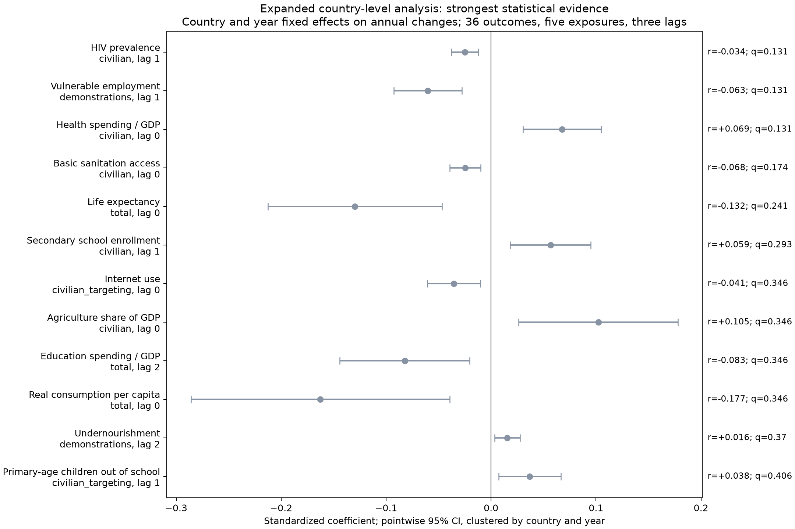
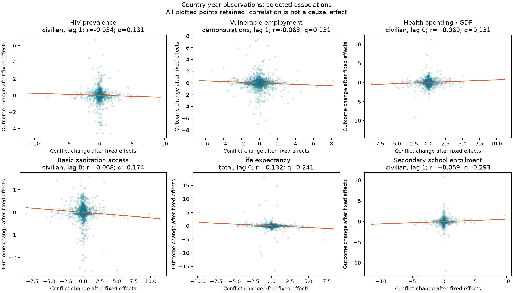
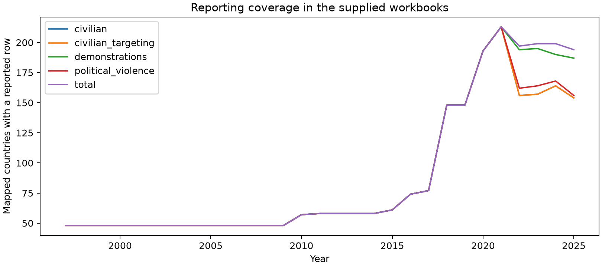
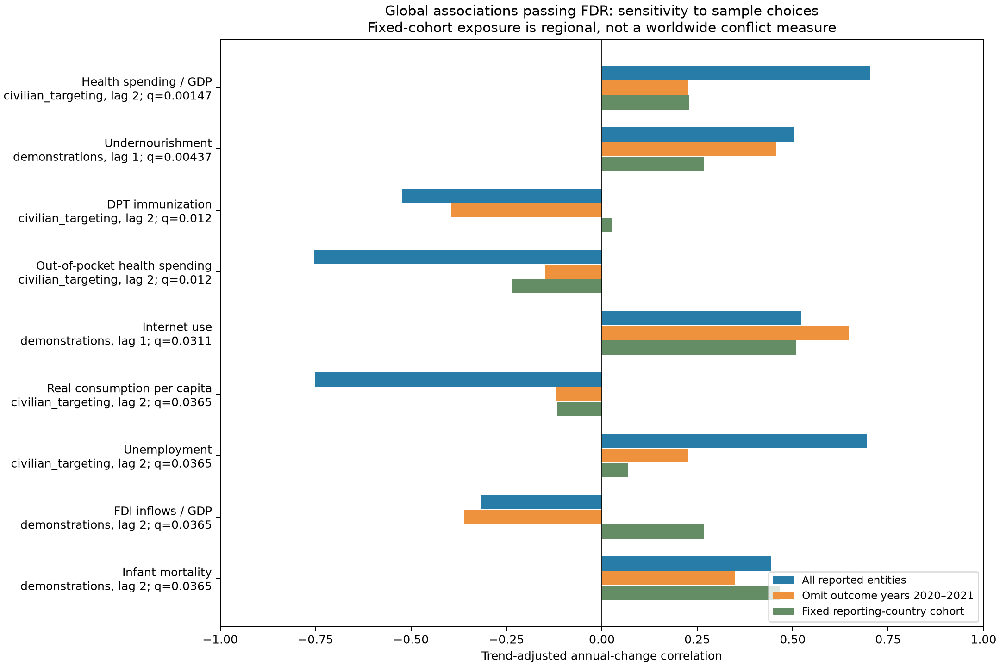

# Expanded analysis using the new datasets

Added 12 non-conflict indicators, bringing the outcome set to 36. Fitted 473 eligible country-panel tests of 540 prespecified combinations. 0 pass BH q < 0.05; 0 pass Holm family-wise correction. These remain exploratory associations, not causal effects or validated forecasts.

## New data

- Added civilian fatalities, civilian-targeting events, demonstration events, and annual political-violence events as separate predictors, alongside total fatalities. Date-indexed pandas copies are saved beside each new workbook.
- Total-fatalities duplicate audit: previously verified identical; user subsequently removed copy. Annual political-violence counts equal the existing monthly sums: True. Neither duplicate representation is counted twice. Exposures are tested separately, never added together; demonstrations are not assumed to be violent.
- Exclude partial 2026. Reporting expands geographically over time. Missing country-years are not zero-filled. Country-name mappings and unmatched territories/oceans are exported for review. Fixed effects do not eliminate changes in reporting quality or selection.

## Additional outcomes

Tuberculosis incidence, Undernourishment, HIV prevalence, Physicians per 1,000 people, Skilled birth attendance, Education spending / GDP, Primary-age children out of school, Income inequality (Gini), Youth unemployment, Female labor force participation, Agriculture share of GDP, Real GNI per capita. Sparse markers are retained in the audit and skipped where minimum sample requirements fail.

## Strongest country-level evidence

One best statistical result per outcome is displayed; all eligible tests are included in the multiple-comparison correction. r is the within-sample correlation after removing country and year effects. A small r can be statistically significant in a large panel.

| Outcome | Exposure | Timing | r | p-value | Adjusted q |
| --- | --- | --- | ---: | ---: | ---: |
| HIV prevalence | Civilian fatalities | 1 year | -0.034 | 0.000583 | 0.1314 |
| Vulnerable employment | Demonstrations | 1 year | -0.063 | 0.000762 | 0.1314 |
| Health spending / GDP | Civilian fatalities | Same year | +0.069 | 0.0010 | 0.1314 |
| Basic sanitation access | Civilian fatalities | Same year | -0.068 | 0.0022 | 0.1740 |
| Life expectancy | Total fatalities | Same year | -0.132 | 0.0036 | 0.2407 |
| Secondary school enrollment | Civilian fatalities | 1 year | +0.059 | 0.0056 | 0.2930 |
| Internet use | Events targeting civilians | Same year | -0.041 | 0.0074 | 0.3462 |
| Agriculture share of GDP | Civilian fatalities | Same year | +0.105 | 0.0102 | 0.3462 |
| Education spending / GDP | Total fatalities | 2 years | -0.083 | 0.0114 | 0.3462 |
| Real consumption per capita | Total fatalities | Same year | -0.177 | 0.0117 | 0.3462 |
| Undernourishment | Demonstrations | 2 years | +0.016 | 0.0149 | 0.3697 |
| Primary-age children out of school | Events targeting civilians | 1 year | +0.038 | 0.0172 | 0.4058 |

**Sample sizes and stricter correction**

| Outcome | Country-year observations | Countries | Holm-adjusted p |
| --- | ---: | ---: | ---: |
| HIV prevalence | 1,557 | 128 | 0.2758 |
| Vulnerable employment | 1,889 | 178 | 0.3595 |
| Health spending / GDP | 1,569 | 159 | 0.4775 |
| Basic sanitation access | 1,701 | 160 | 1.0000 |
| Life expectancy | 1,985 | 197 | 1.0000 |
| Secondary school enrollment | 889 | 130 | 1.0000 |
| Internet use | 1,748 | 156 | 1.0000 |
| Agriculture share of GDP | 1,860 | 167 | 1.0000 |
| Education spending / GDP | 901 | 111 | 1.0000 |
| Real consumption per capita | 1,654 | 158 | 1.0000 |
| Undernourishment | 1,200 | 120 | 1.0000 |
| Primary-age children out of school | 894 | 118 | 1.0000 |

Timing indicates how much earlier the exposure change occurs. Adjusted q uses Benjamini–Hochberg correction; none of these country-level results has q < 0.05.

## Influence checks

Refit the top eight distinct outcomes after dropping each country in turn. These checks are descriptive and selected after screening; p-values here are unadjusted.

| Outcome | Country omitted | β: full → omitted | p-value after omission | Sign stable? |
| --- | --- | --- | ---: | --- |
| HIV prevalence | Namibia | -0.025 → -0.031 | 0.0121 | Yes |
| Vulnerable employment | Ecuador | -0.060 → -0.048 | 0.0038 | Yes |
| Health spending / GDP | Burundi | +0.068 → +0.078 | 0.000011 | Yes |
| Basic sanitation access | Sudan | -0.025 → -0.019 | 0.0988 | Yes |
| Life expectancy | Central African Republic | -0.130 → -0.182 | 0.0050 | Yes |
| Secondary school enrollment | Thailand | +0.057 → +0.076 | 0.0016 | Yes |
| Internet use | Ghana | -0.036 → -0.042 | 0.0100 | Yes |
| Agriculture share of GDP | Rwanda | +0.102 → +0.084 | 0.0276 | Yes |

β is the standardized coefficient. “Sign stable” means its direction stayed the same under every single-country omission; it does not mean statistical significance was retained.

## Global comparisons with supplied exposures

475 eligible world-series tests; 9 pass their separately corrected HAC threshold. These comparisons sum reported exposure counts and therefore retain the expanding-coverage problem. Results and Darts ARIMAX checks are in global_tests.csv. They are secondary descriptive checks, not evidence of a consistent historical global exposure.

## Global findings and robustness

The global associations below pass their own multiple-testing correction, but the strongest civilian-targeting associations shrink markedly when pandemic outcome years are omitted. None of these selected associations passes FDR in the fixed-country sensitivity. That sensitivity measures a regional cohort against world outcomes, so it does not prove the worldwide relationship is absent; it shows the conclusion is not stable across the available reporting samples.

**Main global results**

| Outcome | Exposure | Timing | r | p-value | Adjusted q |
| --- | --- | --- | ---: | ---: | ---: |
| Health spending / GDP | Events targeting civilians | 2 years | +0.704 | 0.000003 | 0.0015 |
| Undernourishment | Demonstrations | 1 year | +0.502 | 0.000018 | 0.0044 |
| DPT immunization | Events targeting civilians | 2 years | -0.524 | 0.000099 | 0.0120 |
| Out-of-pocket health spending | Events targeting civilians | 2 years | -0.754 | 0.000101 | 0.0120 |
| Internet use | Demonstrations | 1 year | +0.523 | 0.000327 | 0.0311 |
| Real consumption per capita | Events targeting civilians | 2 years | -0.752 | 0.000691 | 0.0365 |
| Unemployment | Events targeting civilians | 2 years | +0.694 | 0.000671 | 0.0365 |
| FDI inflows / GDP | Demonstrations | 2 years | -0.315 | 0.000604 | 0.0365 |
| Infant mortality | Demonstrations | 2 years | +0.442 | 0.000475 | 0.0365 |

**Robustness checks for the same relationships**

| Outcome | Original r | r without 2020–2021 | Fixed-cohort r | Fixed-cohort q |
| --- | ---: | ---: | ---: | ---: |
| Health spending / GDP | +0.704 | +0.226 | +0.228 | 0.6501 |
| Undernourishment | +0.502 | +0.456 | +0.266 | 0.5163 |
| DPT immunization | -0.524 | -0.395 | +0.026 | 0.9847 |
| Out-of-pocket health spending | -0.754 | -0.149 | -0.237 | 0.5727 |
| Internet use | +0.523 | +0.647 | +0.508 | 0.6491 |
| Real consumption per capita | -0.752 | -0.118 | -0.117 | 0.7390 |
| Unemployment | +0.694 | +0.226 | +0.069 | 0.8754 |
| FDI inflows / GDP | -0.315 | -0.361 | +0.268 | 0.4971 |
| Infant mortality | +0.442 | +0.347 | +0.467 | 0.2320 |

All correlations describe annual changes after removing a linear time trend. The fixed-cohort check uses a regional reporting sample, not worldwide exposure.

Fixed cohorts contain countries with a reported row in every year 1997–2025, selected separately for each exposure; their identities reflect historical reporting coverage. Rates use those countries’ population sums. The no-pandemic column refits the linear trend after omitting outcome years 2020–2021 and reports a descriptive correlation only; it does not collapse those gaps for an ARIMA fit.

## Method and limits

1. Use all observed country-year outcome pairs in 1997–2025, official World Bank country codes, and reported country fatalities/event counts. No interpolation. Outcomes are annual differences; positive economic levels and mortality/incidence series labeled log use 100 × log differences. Shares use percentage-point differences. Sparse surveys such as Gini and physician counts often cannot provide consecutive annual changes.
2. Exposure is change in log(1 + reported fatalities/events per 100,000 population), examined at lags 0, 1, 2. Calendar grids are created before differencing and lagging, so missing years do not collapse time. To reduce partial-first-year effects, the first allowable exposure change is two years after a country’s first reported year. Intermittent missing reporting remains missing.
3. Regress standardized outcome changes on standardized exposure changes with country and year fixed effects, absorbing them by alternating projections. This controls persistent differences in growth between countries and common year shocks. It does not establish causality, solve endogenous reporting, or control all time-varying confounders. Each country-year has equal weight, not population weight.
4. Two-sided coefficient tests use a country + year − country-year two-way clustered sandwich covariance, finite-sample correction accounting for absorbed effects, and Student t with min(country clusters, year clusters)−1 degrees of freedom. Minimum 300 observations, 30 countries, 15 years; iterative singleton removal. Nonpositive variance or insufficient samples are flagged, not assigned significant p-values.
5. BH FDR and Holm correction cover every eligible outcome × exposure × lag panel test. Overlapping exposure results are dependent, not separate replications. Added markers and country-level methods were chosen after an earlier unsuccessful global screen; this entire exercise is exploratory, with no independent confirmation sample.
6. Secondary global tests use longest continuous runs of at least 20 annual changes, a linear time trend, two-sided HAC tests with bandwidth 2, and separate BH correction. Darts ARIMA(1,0,0) on changes with trend and exposure covariates checks an alternative AR(1) error model. The global model family is distinct from the country panel; do not combine their p-values as replications.
7. Some health, employment and nutrition indicators are modeled or smoothed estimates rather than new annual measurements. National-account shares can change because their GDP denominator changes. Results are associations with measured changes, not intervention effect sizes.

## Files and reproduction

Run `python analysis/fetch_expanded_markers.py`, then `python analysis/expanded_country_analysis.py`. Dependencies are the existing analysis environment. Raw API responses, exact definitions, marker shortlist, source hashes, mapping audit, full test tables, influence checks and charts are saved here. Original source/metadata files are verified unchanged.

Sources: [World Bank indicator catalog](https://data.worldbank.org/indicator), [World Bank health indicators](https://data.worldbank.org/topic/8), [two-way clustered covariance reference](https://www.statsmodels.org/stable/generated/statsmodels.stats.sandwich_covariance.cov_cluster_2groups.html).

## Relationship time-series graphs

[View all nine relationships, raw series and lag-aligned changes](time_series/index.md) · [Download PDF](time_series/relationship_time_series.pdf)

