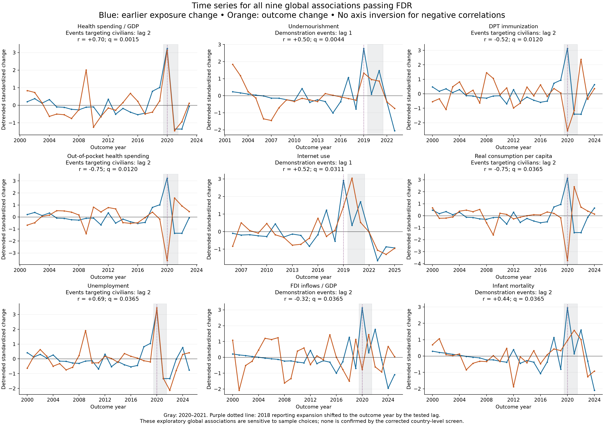
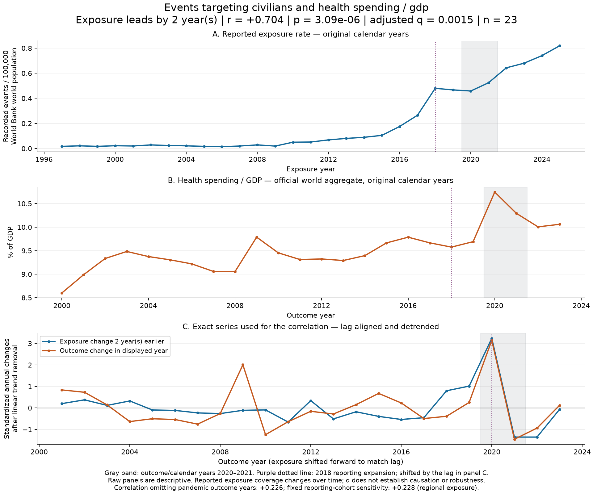
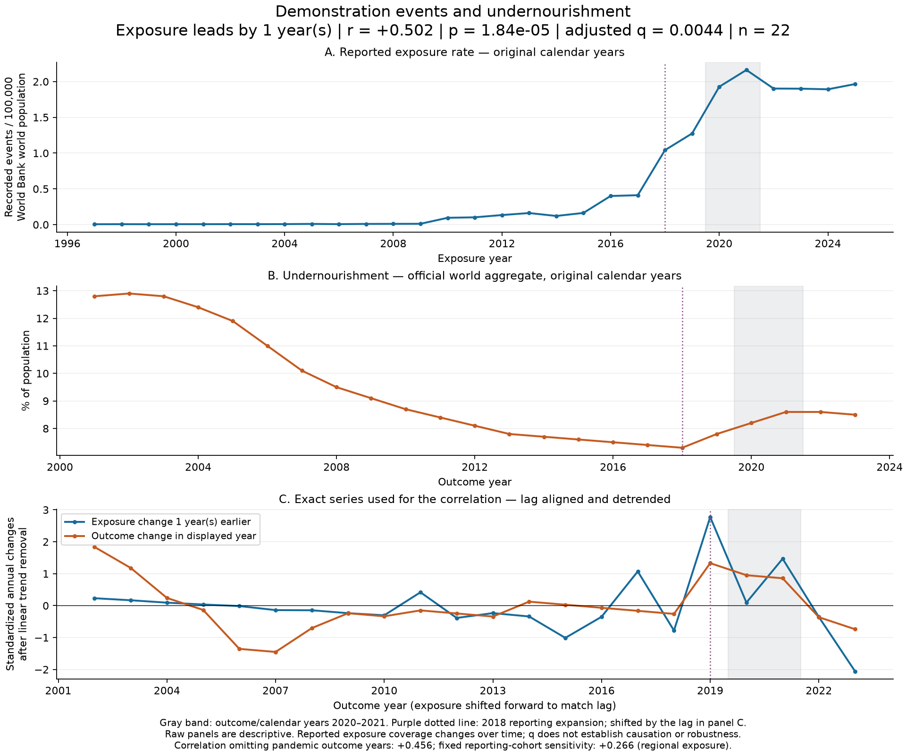
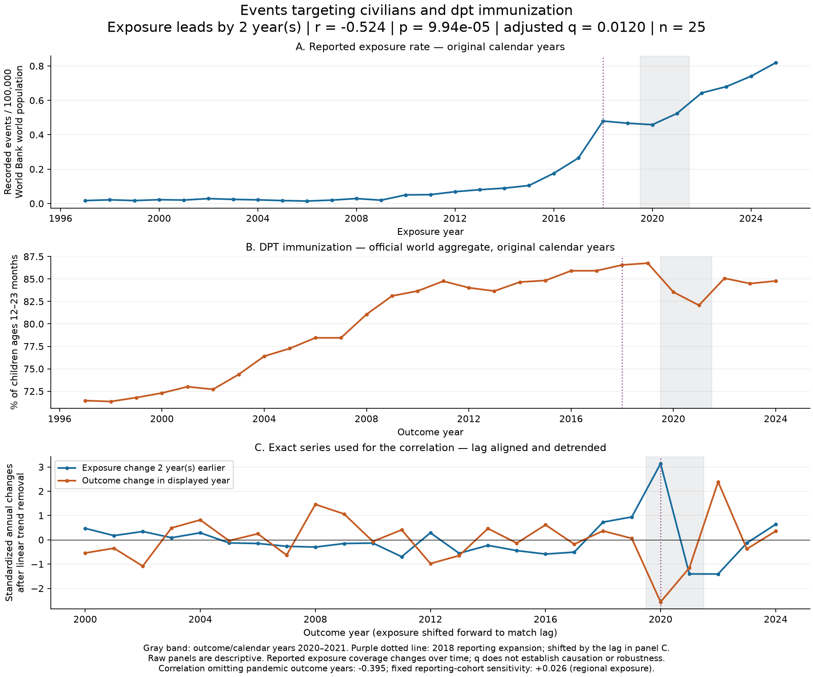
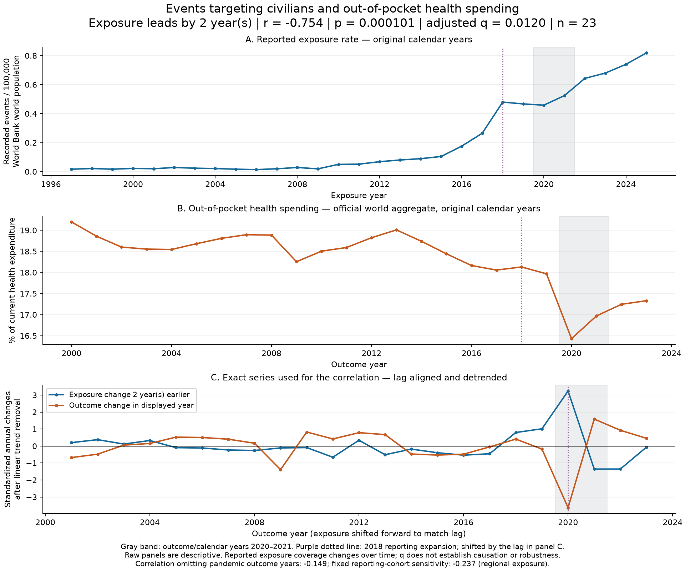
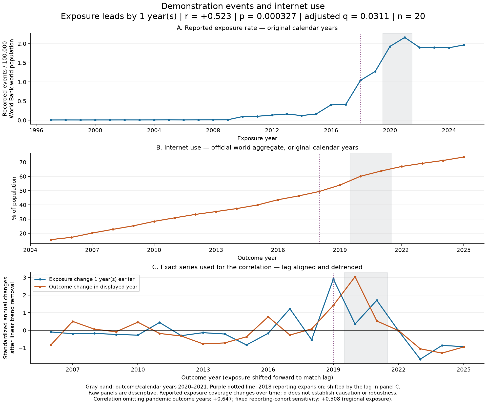
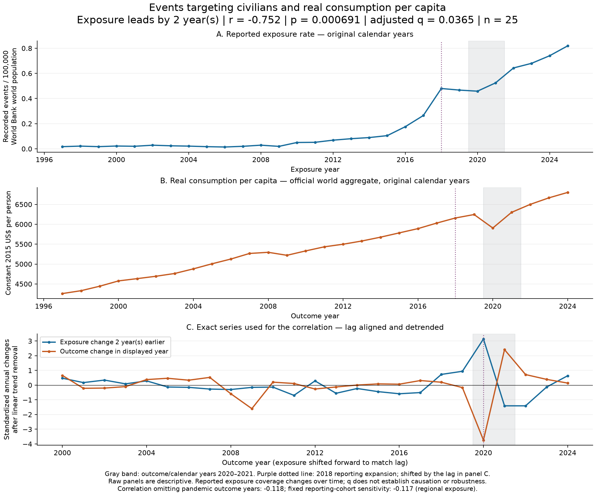
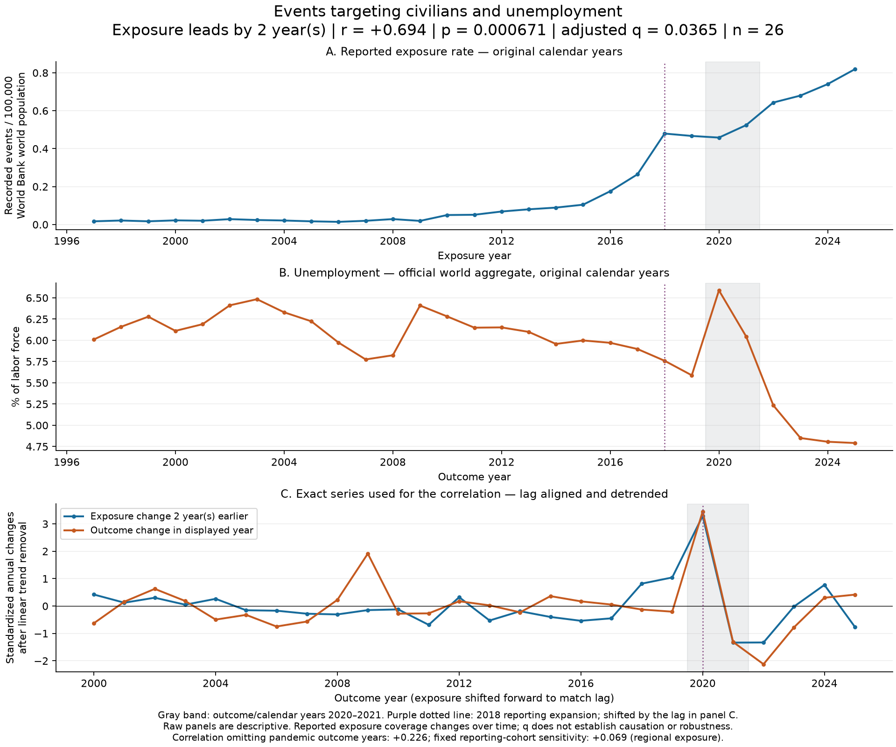
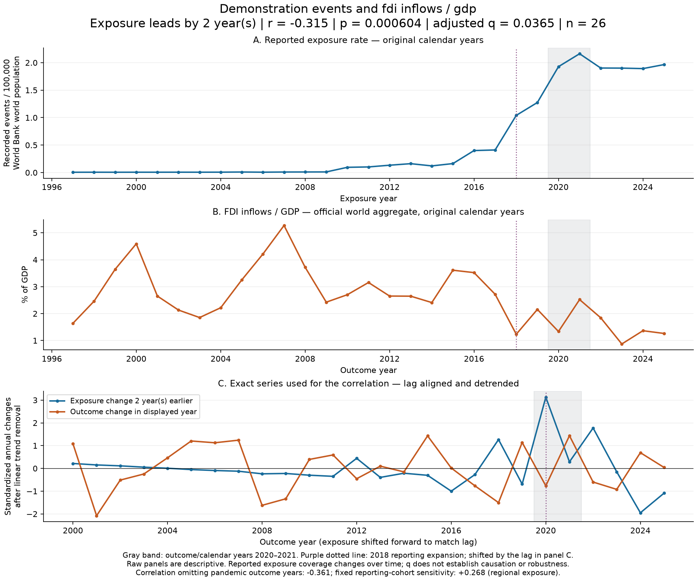
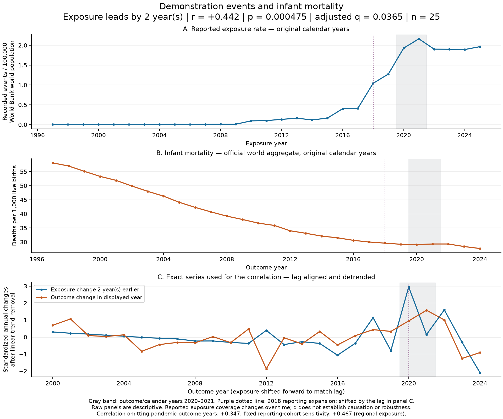

# Time series of significant global relationships

These plots reproduce the nine global relationships with BH q < 0.05 from the existing analysis. No additional tests or model selection were performed. Each detailed figure shows the original exposure rate, the original outcome level, and the exact lag-aligned changes used in the reported test.

[Download the complete PDF](relationship_time_series.pdf) · [Selected results](plotted_relationships.csv)

The comparison panels standardize each change series within its model sample and remove a linear calendar-year trend. Positive/negative directions are preserved. A year on these panels refers to the outcome year; the blue exposure comes from one or two years earlier, as labeled. Raw panels retain actual dates, units and missing values. No interpolation or extra smoothing is applied.

The gray band marks 2020–2021. The purple line flags the 2018 expansion in reporting; in aligned panels it appears at 2018 plus the tested lag. This is context, not a statistical estimate of a break date. Raw rates divide reported events by world population and should not be interpreted as complete global incidence.

## Individual relationships

### Health spending / GDP

Events targeting civilians, 2-year lag. r = +0.704, p = 3.09344e-06, q = 0.0015, n = 23.

[SVG](SH.XPD.CHEX.GD.ZS_civilian_targeting_lag2.svg) · [Plotted data](SH.XPD.CHEX.GD.ZS_civilian_targeting_lag2.csv)

### Undernourishment

Demonstration events, 1-year lag. r = +0.502, p = 1.84116e-05, q = 0.0044, n = 22.

[SVG](SN.ITK.DEFC.ZS_demonstrations_lag1.svg) · [Plotted data](SN.ITK.DEFC.ZS_demonstrations_lag1.csv)

### DPT immunization

Events targeting civilians, 2-year lag. r = -0.524, p = 9.93913e-05, q = 0.0120, n = 25.

[SVG](SH.IMM.IDPT_civilian_targeting_lag2.svg) · [Plotted data](SH.IMM.IDPT_civilian_targeting_lag2.csv)

### Out-of-pocket health spending

Events targeting civilians, 2-year lag. r = -0.754, p = 0.000101014, q = 0.0120, n = 23.

[SVG](SH.XPD.OOPC.CH.ZS_civilian_targeting_lag2.svg) · [Plotted data](SH.XPD.OOPC.CH.ZS_civilian_targeting_lag2.csv)

### Internet use

Demonstration events, 1-year lag. r = +0.523, p = 0.000327157, q = 0.0311, n = 20.

[SVG](IT.NET.USER.ZS_demonstrations_lag1.svg) · [Plotted data](IT.NET.USER.ZS_demonstrations_lag1.csv)

### Real consumption per capita

Events targeting civilians, 2-year lag. r = -0.752, p = 0.000690864, q = 0.0365, n = 25.

[SVG](NE.CON.PRVT.PC.KD_civilian_targeting_lag2.svg) · [Plotted data](NE.CON.PRVT.PC.KD_civilian_targeting_lag2.csv)

### Unemployment

Events targeting civilians, 2-year lag. r = +0.694, p = 0.000671242, q = 0.0365, n = 26.

[SVG](SL.UEM.TOTL.ZS_civilian_targeting_lag2.svg) · [Plotted data](SL.UEM.TOTL.ZS_civilian_targeting_lag2.csv)

### FDI inflows / GDP

Demonstration events, 2-year lag. r = -0.315, p = 0.000603949, q = 0.0365, n = 26.

[SVG](BX.KLT.DINV.WD.GD.ZS_demonstrations_lag2.svg) · [Plotted data](BX.KLT.DINV.WD.GD.ZS_demonstrations_lag2.csv)

### Infant mortality

Demonstration events, 2-year lag. r = +0.442, p = 0.000475335, q = 0.0365, n = 25.

[SVG](SP.DYN.IMRT.IN_demonstrations_lag2.svg) · [Plotted data](SP.DYN.IMRT.IN_demonstrations_lag2.csv)
