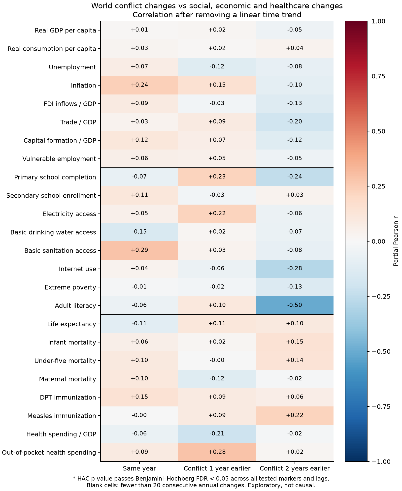
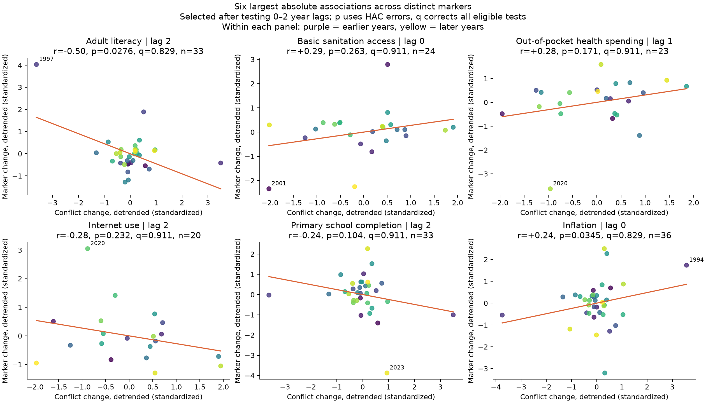
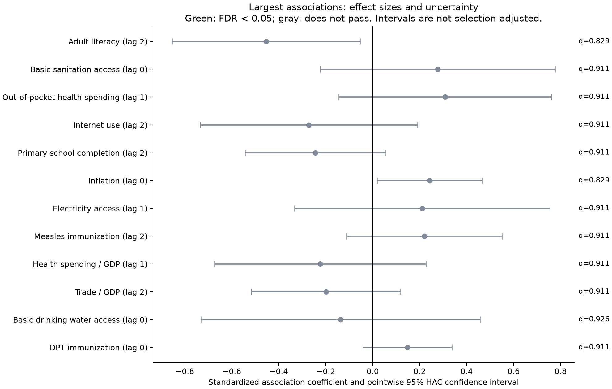

# Social, economic and healthcare markers vs global conflict

Screened 24 non-conflict outcomes at lags 0, 1 and 2. 72 of 72 prespecified tests had at least 20 consecutive annual changes; 0 pass the primary FDR threshold q < 0.05. Displacement, refugees, violence and governance are excluded from outcomes. Conflict remains the predictor.

The largest association is Adult literacy at lag 2 (r = -0.501, HAC p = 0.0276, q = 0.8287). Removing its most influential response year, 1997, changes r to +0.067. This is a sensitivity check, not a reason to delete that year from the primary analysis.

The alternative ARIMAX specification has 1 coefficients with its own q < 0.05, while circular-shift tests have 0. Thus conclusions depend on the error model; ARIMAX uses model-based outer-product-of-gradients covariance and should not override conflicting robust tests or influence diagnostics.

## Strongest associations

Ranked by absolute trend-adjusted correlation, one best lag per marker. A large correlation is not automatically significant. Positive lag means conflict occurs first. Positive r means changes move together, not that the outcome improves; mortality and unemployment have opposite welfare interpretations to GDP and life expectancy.

| Marker | Category | Lag | Years | n | Partial r | HAC p | BH q | Circular-shift p | ARIMAX q |
|---|---|---:|---|---:|---:|---:|---:|---:|---:|
| Adult literacy | Social | 2 | 1992–2024 | 33 | -0.501 | 0.0276 | 0.8287 | 0.0303 | 0.0000 |
| Basic sanitation access | Social | 0 | 2001–2024 | 24 | +0.288 | 0.2629 | 0.9108 | 0.1667 | 0.9904 |
| Out-of-pocket health spending | Healthcare | 1 | 2001–2023 | 23 | +0.282 | 0.1709 | 0.9108 | 0.2174 | 0.9904 |
| Internet use | Social | 2 | 2006–2025 | 20 | -0.282 | 0.2320 | 0.9108 | 0.2500 | 0.9904 |
| Primary school completion | Social | 2 | 1992–2024 | 33 | -0.244 | 0.1043 | 0.9108 | 0.2121 | 0.9904 |
| Inflation | Economic | 0 | 1990–2025 | 36 | +0.242 | 0.0345 | 0.8287 | 0.1389 | 0.9904 |
| Electricity access | Social | 1 | 1999–2024 | 26 | +0.224 | 0.4311 | 0.9108 | 0.2692 | 0.9904 |
| Measles immunization | Healthcare | 2 | 1992–2024 | 33 | +0.222 | 0.1838 | 0.9108 | 0.2424 | 0.9904 |
| Health spending / GDP | Healthcare | 1 | 2001–2023 | 23 | -0.205 | 0.3136 | 0.9108 | 0.3043 | 0.9904 |
| Trade / GDP | Economic | 2 | 1992–2025 | 34 | -0.199 | 0.2111 | 0.9108 | 0.1765 | 0.9904 |







## Statistical tests

- Primary null: the coefficient on conflict change is zero in marker change ~ constant + conflict change + linear calendar-year trend. Standardize both changes. Test is two-sided, Student-t reference with n−3 degrees of freedom and Newey–West/HAC covariance, Bartlett kernel, bandwidth 2 and finite-sample covariance correction. The reported partial r removes a linear time trend from both changes. It is not a raw-level correlation.
- Benjamini–Hochberg adjusts the primary HAC p-values across every eligible marker × lag test, including those not shown among the strongest. The screen is exploratory; correlated outcomes, a small sample and post-selection mean q-values are not a guarantee of replication.
- Sensitivities in all_tests.csv: unadjusted change Pearson r/p (IID assumption; not the primary test), Spearman r, level r, HAC bandwidth 4 p, removal of pandemic response/predictor years, leave-one-year-out correlations, and a circular-shift p-value. Circular shifts preserve the order of each detrended sequence but assume approximate stationarity/circular exchangeability and have coarse resolution 1/n. Their own BH q-values are included. Leave-one-out removal refits the time trend and reports sensitivity, not a revised preferred estimate.
- Darts ARIMA(1,0,0) on standardized changes, with conflict and linear time trend as external regressors (ARIMAX), checks an alternative AR(1) error specification. Baseline contains the same trend but no conflict. All ARIMAX p-values are separately BH-adjusted over converged fits. Residual Ljung–Box tests, convergence, and AIC differences are saved. Minimum train length is explicitly 20; this remains a small exploratory sample. Models are saved under models/.
- No forecasts or causal effects are claimed. Confidence intervals are pointwise, not adjusted for selecting the strongest associations. Disagreement between HAC, ARIMAX, or circular-shift results should be reported rather than choosing the most favorable p-value.

## Data and transformations

- World Bank official WLD aggregates; the 24-marker shortlist was fixed before testing. Health sources include national/UN/WHO/UNICEF estimates distributed through WDI; exact definitions and providers are in definitions.json. Some global health and social series are modeled or smoothed, so annual values are not independent new surveys.
- Conflict: UCDP OrganizedViolenceCY v26.1, country-year 1989–2025, sum of state-based, non-state and one-sided best-estimate fatalities. Code verifies that component sums equal the dataset's combined deaths. The global proxy uses recorded deaths in UCDP's state coverage divided by World Bank world population, times 100,000. UCDP's inclusion threshold and reporting limitations remain; this is not all violent deaths everywhere.
- GDP, consumption and mortality rates use 100 × annual log change. Other outcomes use annual differences in their stated units (percentage points for shares/rates; years for life expectancy). Inflation is already a rate, so its difference is inflation acceleration. Conflict uses 100 × annual log change in the death rate. See prespecified_markers.csv.
- Annual calendar index is retained before differencing and lagging. No interpolation, no replacement of missing outcomes by zero. Each test uses its longest complete annual segment. Coverage differs across markers; years/n appear in every result. Poverty's missing 2019 value truncates its model sample to the earlier run. No 2026 values are included.
- The original data/ files and metadata remain unchanged; input hashes and package versions are recorded in manifest.json.

## Reproduce

```sh
python analysis/fetch_social_health.py --ucdp
python analysis/social_health_analysis.py
```

Dependencies: analysis/requirements.txt plus requests. Fetching reuses saved raw responses; retain these to reproduce this vintage. Full tests: all_tests.csv; strongest per marker: strongest_by_marker.csv; raw levels and changes: annual_levels.csv and annual_changes.csv. The saved models expect the same training-window standardization and trend used by this script.

Sources: [World Bank WDI people indicators](https://datatopics.worldbank.org/world-development-indicators/themes/people.html), [UCDP v26.1 codebook](https://ucdp.uu.se/downloads/organizedviolencecy/UCDP_OrganizedViolenceCY_Codebook_261.pdf), [statsmodels HAC inference](https://www.statsmodels.org/stable/generated/statsmodels.regression.linear_model.OLSResults.get_robustcov_results.html).
